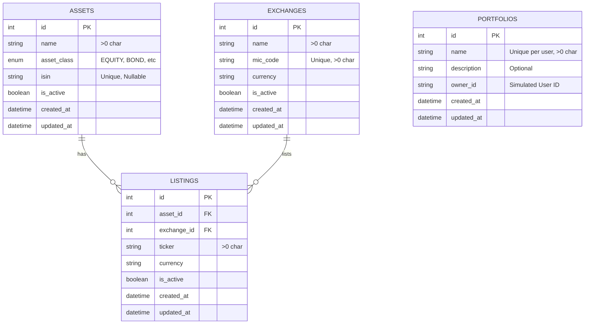

# Architecture & Schema Plan

**Status:** Proposed
**Target:** Phase 1 (MVP)

## 1. Architectural Principles

### 1.1 Smart Database Schema
The database is the **Source of Truth**. We do not rely solely on application logic to maintain data integrity.
*   **Constraints:** Use `CHECK`, `UNIQUE`, `FOREIGN KEY` constraints liberally.
*   **Types:** Use appropriate column types (e.g., `DECIMAL` for money, not `FLOAT`).
*   **Consistency:** ACID properties are enforced by the DBMS.

### 1.2 Clean Architecture
The application is divided into concentric layers, with dependency rules pointing inwards.

*   **Entities (DB Models):** The innermost layer (in this specific pragmatic adaptation, our DB models act as core entities for data structure, while Pydantic models serve as Domain Entities).
*   **Core (Domain Logic):** Contains "Use Cases" (e.g., `CreatePortfolio`). Pure Python/Node code. No framework dependencies (no FastAPI/Express imports here).
*   **Interface Adapters (API/Repositories):**
    *   **Repositories:** Implement interfaces defined in Core to talk to the DB.
    *   **API:** FastAPI/Express routers that receive requests, call Use Cases, and return responses.
*   **Frameworks & Drivers:** The Web Framework, Database Driver, etc.

## 2. System Design

### 2.1 Container Diagram (C4 Level 2)

```mermaid
graph TD
    Client[Client App / Postman]

    subgraph "Docker Host"
        PyAPI[Python Backend\n(FastAPI)]
        NodeAPI[Node Backend\n(Express)]
        DB[(PostgreSQL\nDatabase)]
    end

    Client -->|HTTP/JSON| PyAPI
    Client -->|HTTP/JSON| NodeAPI

    PyAPI -->|SQLAlchemy| DB
    NodeAPI -->|pg driver| DB
```

### 2.2 Component Diagram (Python Example)

```mermaid
graph LR
    subgraph "API Layer"
        Controller[Asset Controller]
    end

    subgraph "Core Layer"
        UseCase[CreateAsset UseCase]
        Port[AssetRepository Interface]
    end

    subgraph "Infrastructure Layer"
        RepoImpl[SQLAlchemy AssetRepo]
        Model[Asset Model]
    end

    Controller --> UseCase
    UseCase --> Port
    RepoImpl ..|> Port
    RepoImpl --> Model
```

## 3. Database Schema Design (Target)

### 3.1 ER Diagram



### 3.2 Table Definitions

#### `assets` (Existing)
*   **Source of Truth** for financial instruments (e.g. a Company, a Fund).
*   **Columns**:
    *   `id`: Serial PK.
    *   `name`: String(255), Not Null.
    *   `asset_class`: Enum (EQUITY, CRYPTO, FX, etc), Not Null.
    *   `isin`: String(12), Nullable, Unique.
    *   `is_active`: Boolean.
*   **Constraints**: Name length > 0.

#### `exchanges` (Existing)
*   **Purpose**: Defines where assets are traded.
*   **Columns**:
    *   `id`: Serial PK.
    *   `name`: String(255), Not Null.
    *   `mic_code`: String(20), Unique, Not Null.
    *   `currency`: String(10), Not Null.
*   **Constraints**: MIC Code and Name length > 0.

#### `listings` (Existing)
*   **Purpose**: Connects an Asset to an Exchange with a specific Ticker.
*   **Columns**:
    *   `id`: Serial PK.
    *   `asset_id`: FK to assets.
    *   `exchange_id`: FK to exchanges.
    *   `ticker`: String(20), Not Null.
    *   `currency`: String(10), Not Null (Trading currency).
*   **Constraints**: Ticker length > 0. Unique (Ticker + Exchange).

#### `portfolios` (Future)
*   **Purpose**: Container for user holdings.
*   **Columns**:
    *   `id`: Serial PK.
    *   `name`: String(100), Not Null.
    *   `description`: Text, Nullable.
    *   `owner_id`: String(50), Not Null (Simulates a User ID until Auth is added).
    *   `created_at` / `updated_at`: Timestamps.
*   **Constraints**:
    *   `name` length > 0.
    *   `owner_id` length > 0.

## 4. Implementation Plan (Phase 1)

### 4.1 Python Backend
1.  **Infrastructure**:
    *   Update `models.py` to include `PortfolioModel`.
    *   Generate and apply Alembic migrations.
    *   Implement `SqlAlchemyAssetRepository` and `SqlAlchemyPortfolioRepository`.
2.  **Core**:
    *   Define Pydantic models (DTOs) for Input/Output.
    *   Implement Use Cases: `GetAsset`, `CreateAsset`, `ListAssets`, `CreatePortfolio`, `GetPortfolio`.
3.  **API**:
    *   Create FastAPI Routers for `/assets` and `/portfolios`.
    *   Wire up dependencies (Controller -> UseCase -> Repo).

### 4.2 Node.js Backend
1.  **Infrastructure**:
    *   Create DB connection module using `pg`.
    *   Implement Repository classes matching the Python interfaces.
2.  **API**:
    *   Implement Express routes mirroring the Python endpoints.
    *   Ensure validation logic (Joi/Zod) matches Pydantic constraints.

## 5. Data Flow Example (Create Asset)
1.  **Request**: `POST /assets` `{ "ticker": "AAPL", "name": "Apple Inc", ... }`
2.  **Validation**: API layer checks types and basic constraints (e.g., ticker max length).
3.  **UseCase**: `CreateAsset` receives valid DTO.
4.  **Repository**: `save(asset_entity)` is called.
5.  **Database**: INSERT statement runs.
    *   *Check*: Is ticker unique?
    *   *Check*: Are strings non-empty?
6.  **Response**: 201 Created with the new Asset ID.
